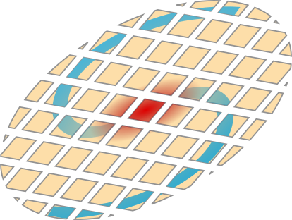

pixSED is a python library that allows to seamlessly perform pixel-per-pixel SED fitting on multi-band images using already existing SED fitting codes as backend. Currently, both [LePhare](https://www.cfht.hawaii.edu/~arnouts/LEPHARE/lephare.html) and [Cigale](https://cigale.lam.fr/) are supported but [Cigale](https://cigale.lam.fr/) should be preferred.

See the [documentation](https://wilfriedmercier.github.io/SED/) for more details.
